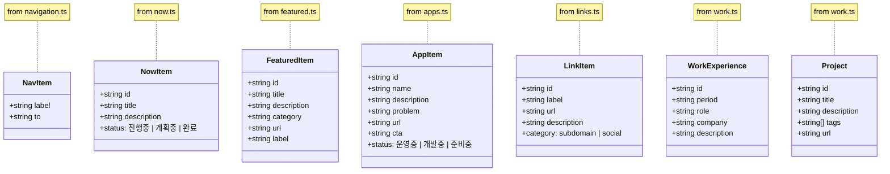

# HelioSent Project Architecture Diagrams

## 1. System Context Diagram (C4 Level 1)

## 2. Container Diagram (C4 Level 2)

## 3. Routing Structure

## 4. Component Interaction Flow

## 5. Data Entity Diagram (Class Diagram)

## 6. Component Architecture

## 7. Project Directory Structure

