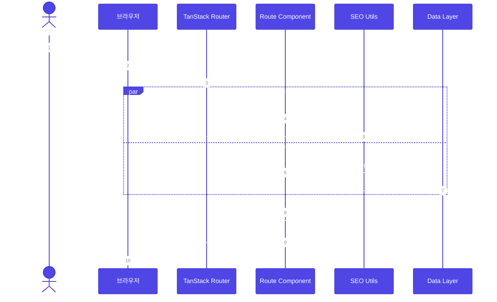
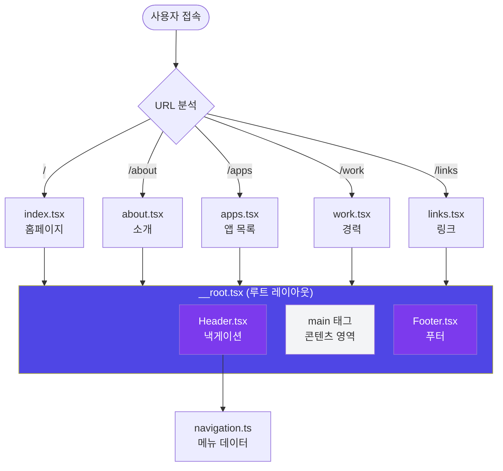
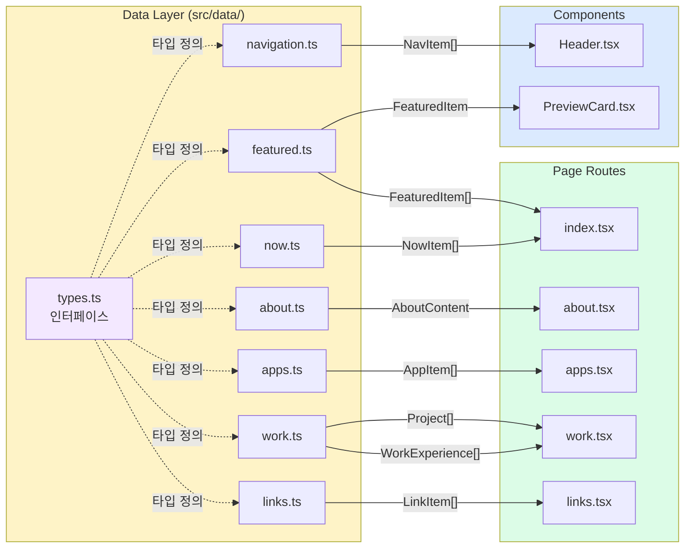
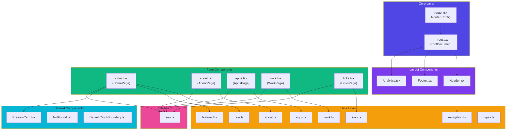
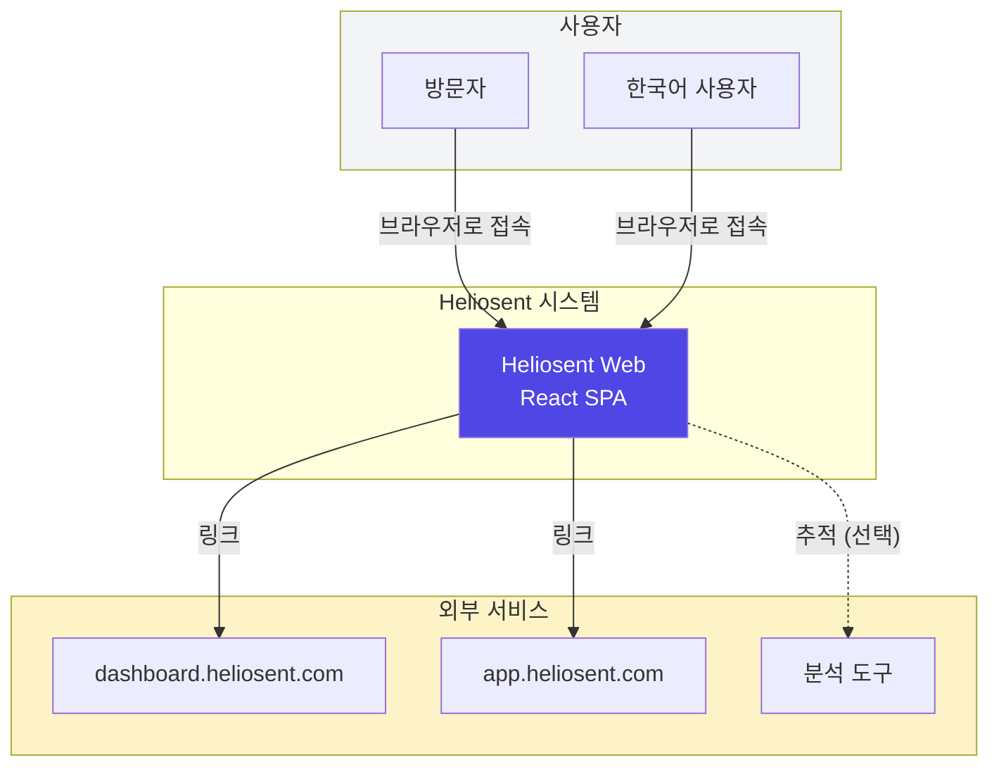
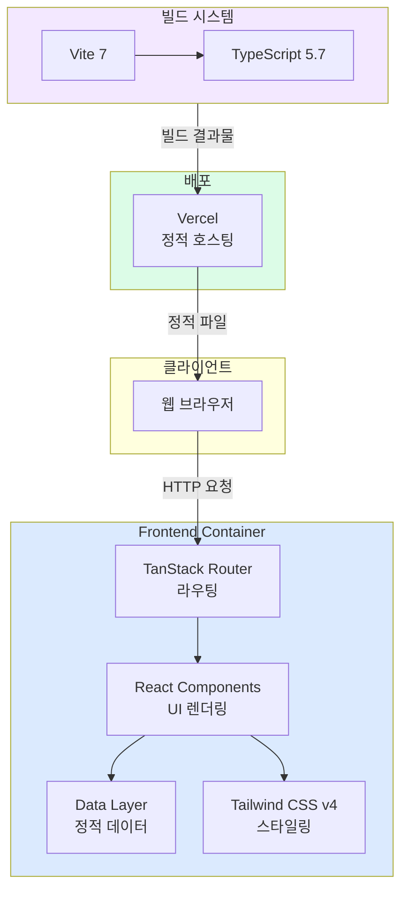
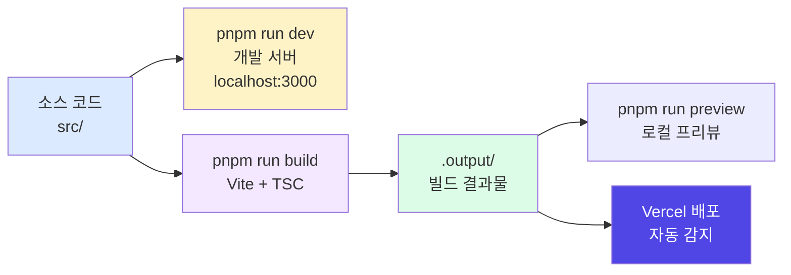

# Heliosent 웹 프로젝트 분석 문서

> TanStack Start + React 19 + TypeScript 5.7 + Tailwind CSS v4 기반 브랜드 허브 웹사이트

---

## 1. 문서 개요

### 1.1 프로젝트 정보

| 항목           | 내용                                                      |
| -------------- | --------------------------------------------------------- |
| **프로젝트명** | Heliosent Web                                             |
| **유형**       | 브랜드 허브 웹사이트 (정적 콘텐츠)                        |
| **기술 스택**  | TanStack Start, React 19, TypeScript 5.7, Tailwind CSS v4 |
| **언어**       | 한국어 (ko)                                               |
| **배포**       | Vercel (정적 호스팅)                                      |

### 1.2 아키텍처 특징

- **파일 기반 라우팅**: TanStack Router의 파일 기반 라우팅 시스템 사용
- **정적 데이터 레이어**: 외부 API 없이 `src/data/`의 TypeScript 파일에서 콘텐츠 관리
- **컴포넌트 기반 구조**: 재사용 가능한 UI 컴포넌트와 페이지 컴포넌트 분리
- **타입 안전성**: 모든 데이터에 TypeScript 인터페이스 적용

---

## 2. 소스 구조 (Source Tree)

```
heliosent-web/
├── docs/                          # 문서화
│   ├── architecture-diagrams.md   # 아키텍처 다이어그램
│   └── architecture-diagrams.html # 인터랙티브 HTML 보고서
├── public/                        # 정적 파일
├── src/
│   ├── components/                # 공유 UI 컴포넌트
│   │   ├── Analytics.tsx          # 분석 도구 통합
│   │   ├── DefaultCatchBoundary.tsx # 에러 경계
│   │   ├── Footer.tsx             # 푸터
│   │   ├── Header.tsx             # 헤더/낵게이션
│   │   ├── NotFound.tsx           # 404 페이지
│   │   └── PreviewCard.tsx        # 카드 컴포넌트
│   ├── data/                      # 정적 데이터 레이어
│   │   ├── types.ts               # TypeScript 인터페이스 정의
│   │   ├── about.ts               # 소개/원칙 콘텐츠
│   │   ├── apps.ts                # 앱/서비스 목록
│   │   ├── featured.ts            # 메인 페이지 주요 콘텐츠
│   │   ├── links.ts               # 서브도메인 + 소셜 링크
│   │   ├── navigation.ts          # 낵게이션 메뉴
│   │   ├── now.ts                 # 현재 진행 중인 항목
│   │   └── work.ts                # 경력, 프로젝트
│   ├── routes/                    # 파일 기반 라우트
│   │   ├── __root.tsx             # 루트 레이아웃 (전체 페이지 래핑)
│   │   ├── index.tsx              # / (홈)
│   │   ├── about.tsx              # /about
│   │   ├── apps.tsx               # /apps
│   │   ├── work.tsx               # /work
│   │   └── links.tsx              # /links
│   ├── styles/
│   │   └── app.css                # Tailwind CSS v4 (테마 정의)
│   ├── utils/
│   │   └── seo.ts                 # SEO 유틸리티
│   ├── router.tsx                 # 라우터 설정
│   └── routeTree.gen.ts           # 자동 생성된 라우트 트리
├── package.json
├── vite.config.ts
├── tsconfig.json
└── README.md
```

---

## 3. 처리 흐름 (Processing Flow)

### 3.1 페이지 로드 시퀀스



### 3.2 라우팅 및 레이아웃 흐름



### 3.3 데이터 흐름 (Data Flow)



---

## 4. 모듈 역할 (Module Roles)

### 4.1 Core Orchestration (핵심 조정)

진입점 및 전역 설정을 관리하는 모듈들입니다.

| 모듈                   | 역할              | 설명                                                               |
| ---------------------- | ----------------- | ------------------------------------------------------------------ |
| **`router.tsx`**       | 라우터 팩토리     | TanStack Router 인스턴스 생성 및 설정 (scrollRestoration, preload) |
| **`__root.tsx`**       | 루트 레이아웃     | 모든 페이지의 공통 레이아웃 제공 (Header, Footer, Analytics)       |
| **`routeTree.gen.ts`** | 라우트 레지스트리 | 파일 기반 라우팅의 자동 생성된 라우트 트리                         |
| **`app.css`**          | 전역 스타일       | Tailwind CSS v4 테마 변수 및 Pretendard 폰트 설정                  |

### 4.2 Engines/Logic (엔진/로직)

핵심 처리 로직을 담당하는 모듈들입니다.

| 모듈                  | 역할        | 설명                                               |
| --------------------- | ----------- | -------------------------------------------------- |
| **`types.ts`**        | 타입 시스템 | 모든 데이터 구조의 TypeScript 인터페이스 정의      |
| **`seo.ts`**          | SEO 엔진    | 메타 태그, Open Graph, Twitter Cards 생성 유틸리티 |
| **`TanStack Router`** | 라우팅 엔진 | 파일 기반 라우팅, 코드 스플리팅, 프리로딩 관리     |

**데이터 인터페이스 상세:**

```typescript
// Core Data Types
interface NavItem {
  label: string
  to: string
}
interface NowItem {
  id
  title
  description
  status: '진행 중' | '계획 중' | '완료'
}
interface FeaturedItem {
  id
  title
  description
  category
  url
  label
}
interface AppItem {
  id
  name
  description
  problem
  url
  cta
  status: '운영 중' | '개발 중' | '준비 중'
}
interface LinkItem {
  id
  label
  url
  description
  category: 'subdomain' | 'social'
}
interface WorkExperience {
  id
  period
  role
  company
  description
}
interface Project {
  id
  title
  description
  tags: string[]
  url
}
```

### 4.3 Renderers/Output (렌더러/출력)

UI 렌더링과 페이지 출력을 담당하는 모듈들입니다.

#### 페이지 컴포넌트 (Routes)

| 파일            | 경로     | 주요 기능                               |
| --------------- | -------- | --------------------------------------- |
| **`index.tsx`** | `/`      | Hero 섹션, Now 목록, Featured 항목 표시 |
| **`about.tsx`** | `/about` | 소개 문구, 핵심 원칙 카드               |
| **`apps.tsx`**  | `/apps`  | 앱/서비스 목록, 상태별 필터링           |
| **`work.tsx`**  | `/work`  | 경력 사항, 프로젝트 포트폴리오          |
| **`links.tsx`** | `/links` | 서브도메인 및 소셜 링크                 |

#### 공유 컴포넌트 (Shared)

| 파일                           | 역할          | Props                                              |
| ------------------------------ | ------------- | -------------------------------------------------- |
| **`Header.tsx`**               | 상단 낵게이션 | - (navigation.ts 데이터 사용)                      |
| **`Footer.tsx`**               | 하단 푸터     | -                                                  |
| **`PreviewCard.tsx`**          | 콘텐츠 카드   | `title`, `description`, `category`, `url`, `label` |
| **`NotFound.tsx`**             | 404 페이지    | -                                                  |
| **`DefaultCatchBoundary.tsx`** | 에러 경계     | 에러 객체                                          |
| **`Analytics.tsx`**            | 분석 스크립트 | - (ANALYTICS_ENABLED 플래그)                       |

### 4.4 Utilities/Helpers (유틸리티/보조)

공통 도구 및 보조 기능을 제공하는 모듈들입니다.

| 모듈                | 역할                    | 사용처                     |
| ------------------- | ----------------------- | -------------------------- |
| **`navigation.ts`** | 낵게이션 메뉴 데이터    | Header.tsx                 |
| **`now.ts`**        | 현재 진행 중인 항목     | index.tsx                  |
| **`featured.ts`**   | 메인 페이지 주요 콘텐츠 | index.tsx, PreviewCard.tsx |
| **`apps.ts`**       | 앱/서비스 목록 데이터   | apps.tsx                   |
| **`links.ts`**      | 링크 데이터             | links.tsx                  |
| **`work.ts`**       | 경력 및 프로젝트 데이터 | work.tsx                   |
| **`about.ts`**      | 소개 콘텐츠 데이터      | about.tsx                  |

---

## 5. 컴포넌트 의존성 다이어그램



---

## 6. 시스템 아키텍처 (C4 모델)

### 6.1 System Context (Level 1)



### 6.2 Container Diagram (Level 2)



---

## 7. 빌드 및 배포 흐름



---

## 8. 개발 가이드

### 8.1 새 페이지 추가

1. `src/routes/`에 `[page-name].tsx` 파일 생성
2. `head()` 함수로 SEO 메타데이터 설정
3. 컴포넌트에서 필요한 데이터 import
4. 자동으로 라우트 등록됨 (`routeTree.gen.ts`)

### 8.2 콘텐츠 수정

모든 콘텐츠는 `src/data/`에서 관리:

| 수정 대상          | 파일            | 타입                            |
| ------------------ | --------------- | ------------------------------- |
| 낵게이션 메뉴      | `navigation.ts` | `NavItem[]`                     |
| 진행 중인 작업     | `now.ts`        | `NowItem[]`                     |
| 메인 페이지 콘텐츠 | `featured.ts`   | `FeaturedItem[]`                |
| 앱/서비스 목록     | `apps.ts`       | `AppItem[]`                     |
| 링크               | `links.ts`      | `LinkItem[]`                    |
| 경력               | `work.ts`       | `WorkExperience[]`, `Project[]` |
| 소개               | `about.ts`      | 문자열, 배열                    |

### 8.3 스타일 수정

- Tailwind CSS v4 사용 (`@theme` 디렉티브)
- 커스텀 색상: `--color-brand`, `--color-muted`, `--color-subtle`, `--color-border`
- 폰트: Pretendard (한국어 지원)

---

## 9. 참고 사항

- **테스트**: 테스트 프레임워크 미설정
- **API**: 외부 API 없음 (정적 데이터만 사용)
- **상태 관리**: React 내장 useState/useEffect만 사용
- **언어**: 모든 콘텐츠는 한국어로 작성

---

_문서 생성일: 2026년 2월 15일_  
_참조: [architecture-diagrams.html](architecture-diagrams.html) 인터랙티브 버전_
